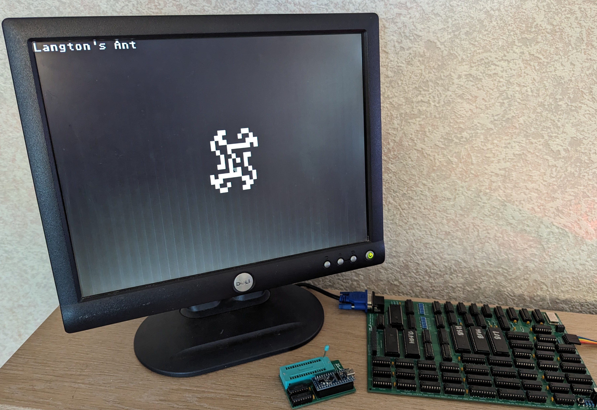

# M64x4LangtonsAnt

An implementation of Langton's Ant for the Minimal 64x4

https://en.wikipedia.org/wiki/Langton%27s_ant

Langont's ant is a cellular automata created by Chris Langton. The 'ant' lives on an infinite grid where the cells can be either black or white. In this implementation the infinite grid is represented by wrapping the screen edges making the grid into a torus. The ant starts on a single cell facing north and follows a rule set. The rules are:

* if cell is white, flip cell to black, turn right, move forward one step
* if cell is black, flip cell to white, turn left, move forward one step

The two simple rules produce emergent behaviour. This referes to seemingly complex behvaiours and patterns that are generated from simple system.

You might expect the ant to produce a simple pattern that repeats. This is true for a short while but the ant then enters a chaotic phase where it appears to move randomly. After a few thousand steps the ant starts to build a 'highway' which, on an infinite grid, would go on forever.

